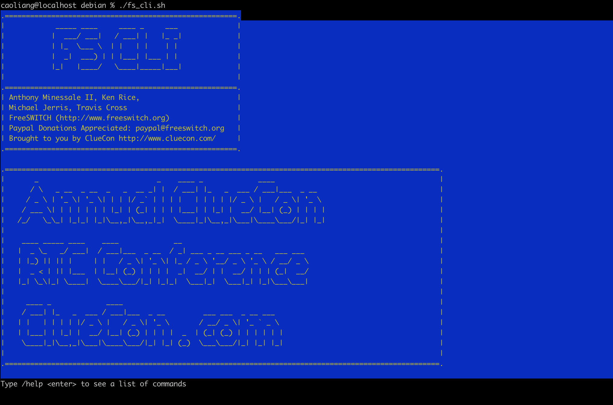
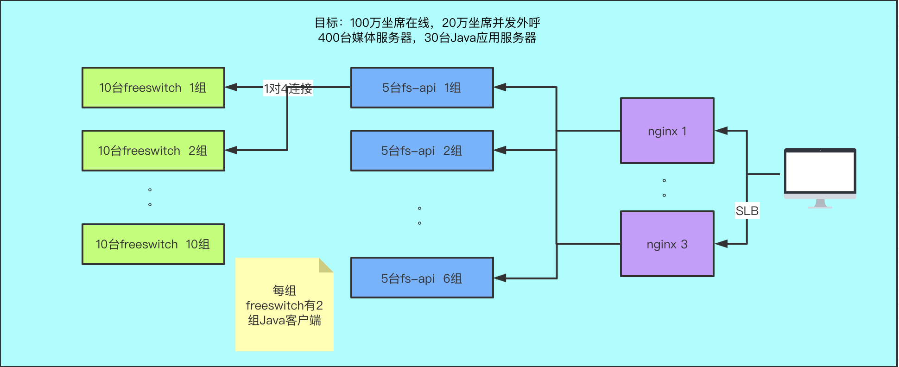
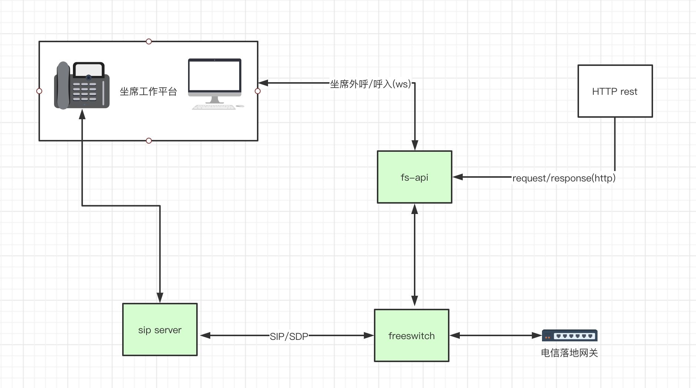
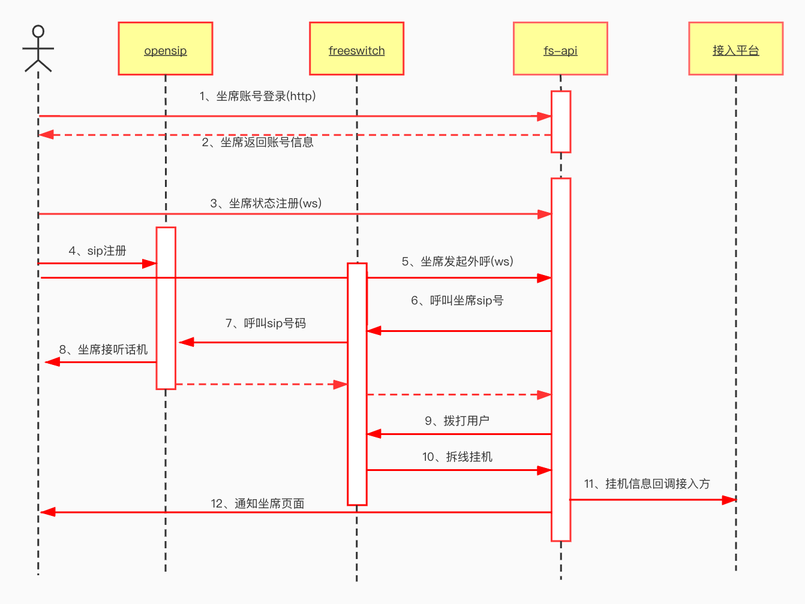
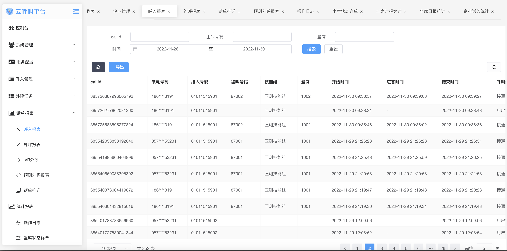
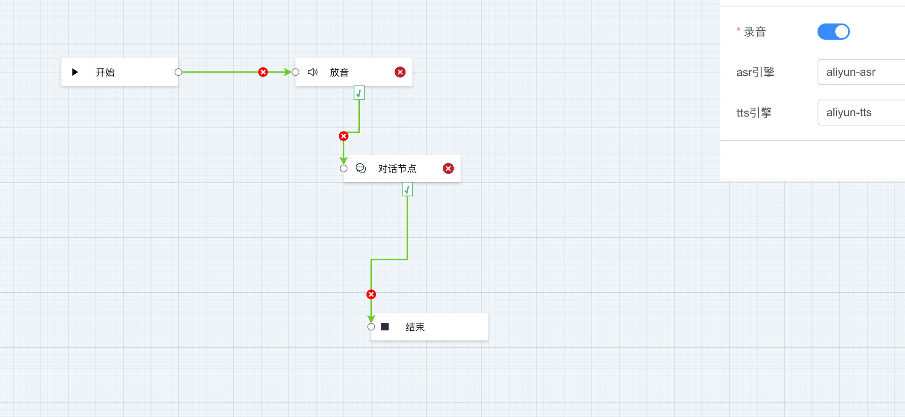
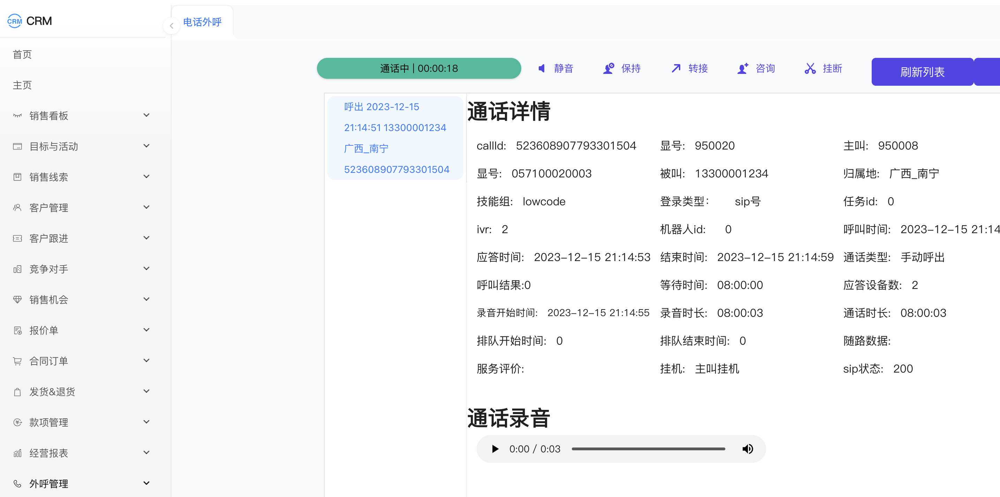
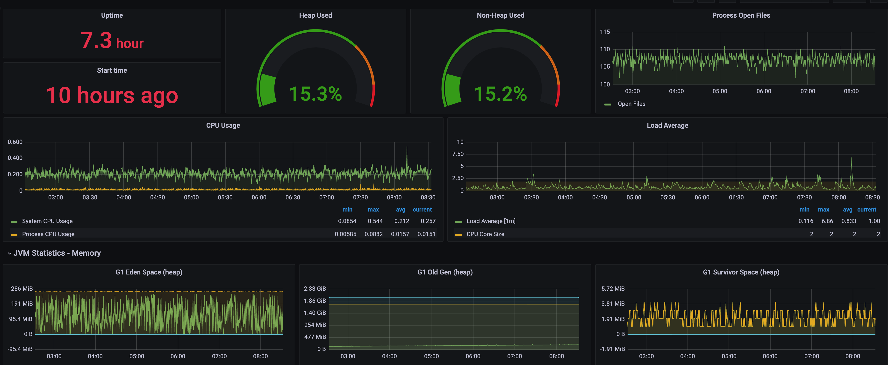
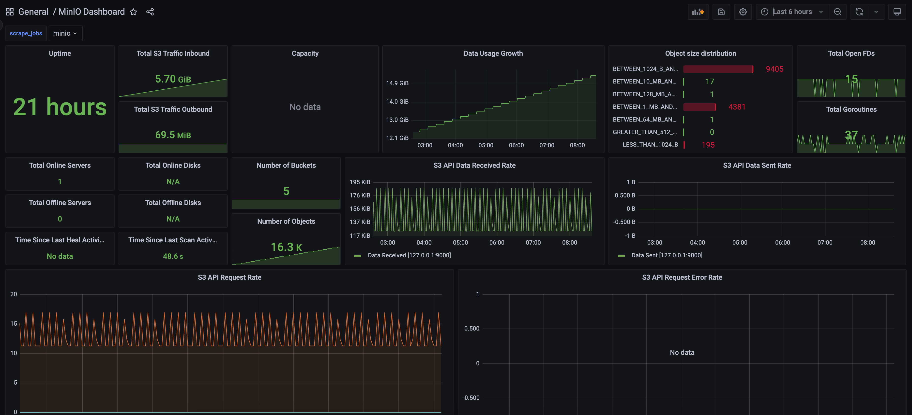

#  

```sh 
docker exec -it d4841fc38f4b /bin/bash
```

```sh 

apt update
apt install net-tools
apt install git -y

netstat -tnlp | grep LISTEN

```
 
```sh 

root@lima-rancher-desktop:/usr/local/freeswitch# netstat -an | grep LISTEN 
tcp        0      0 192.168.5.15:8082       0.0.0.0:*               LISTEN     
tcp        0      0 192.168.5.15:8081       0.0.0.0:*               LISTEN     
tcp        0      0 192.168.5.15:7443       0.0.0.0:*               LISTEN     
tcp        0      0 192.168.5.15:5060       0.0.0.0:*               LISTEN     
tcp        0      0 192.168.5.15:5066       0.0.0.0:*               LISTEN     
tcp        0      0 192.168.5.15:5080       0.0.0.0:*               LISTEN     
tcp        0      0 0.0.0.0:80              0.0.0.0:*               LISTEN     
tcp        0      0 0.0.0.0:22              0.0.0.0:*               LISTEN     
tcp6       0      0 :::8021                 :::*                    LISTEN     
tcp6       0      0 fec0::5055:55ff:fe:8081 :::*                    LISTEN     
tcp6       0      0 fec0::5055:55ff:fe:8082 :::*                    LISTEN     
tcp6       0      0 :::80                   :::*                    LISTEN     
tcp6       0      0 fec0::5055:55ff:fe:5080 :::*                    LISTEN     
tcp6       0      0 :::22                   :::*                    LISTEN     
tcp6       0      0 fec0::5055:55ff:fe:5060 :::*                    LISTEN     
unix  2      [ ACC ]     STREAM     LISTENING     15658    /var/run/docker/libnetwork/aa11fe5edb5d.sock
unix  2      [ ACC ]     SEQPACKET  LISTENING     10127    /run/udev/control
unix  2      [ ACC ]     STREAM     LISTENING     145975   /run/containerd/s/b643a0d3fbe7cb8008b1fbf529db10306c4257d25e28c2f749b3d444e33a1625
unix  2      [ ACC ]     STREAM     LISTENING     11545    /run/lima-guestagent.sock
unix  2      [ ACC ]     STREAM     LISTENING     12482    /var/run/docker.sock
unix  2      [ ACC ]     STREAM     LISTENING     12500    /var/run/docker/containerd/containerd-debug.sock
unix  2      [ ACC ]     STREAM     LISTENING     12502    /var/run/docker/containerd/containerd.sock.ttrpc
unix  2      [ ACC ]     STREAM     LISTENING     12503    /var/run/docker/containerd/containerd.sock
unix  2      [ ACC ]     STREAM     LISTENING     12513    /var/run/docker/metrics.sock
root@lima-rancher-desktop:/usr/local/freeswitch# 
```


```sh 

./fs_cli status

sofia status profile internal 

# 등록된 사용자 표시

show registrations

# 등록된 사용자 수 표시

sofia status profile internal

# 1000을 다이얼하고 에코 프로그램 실행

originate sofia/profile/internal/1000 &echo 

originate user/1000 &echo 

# 소프트폰 1000에서 9999를 누르는 것과 동일

originate sofia/profile/internal/1000 9999

originate sofia/profile/internal/1000 9999 XML default

# 

fs_cli.exe -H 192.168.1.100 -P 8021 -p NewPSW


# 1 포그라운드에서 freeswitch를 시작합니다.

./freeswitch  

# 2 백그라운드에서 freeswitch 실행

./freeswitch   -nc     


# 3. 배경에서 전경으로 전환
./fs_cli         

# 4. 백그라운드 작업으로 돌아가기

...


# 5. 소피아 상태 확인

sofia status

# 6. 등록정보 조회

sofia status profile internal reg   

# 7. 사운드 장치 나열

pa devlist

# 8. 입력 및 출력 포트 지정

pa indev  #0  

pa outdev  #2

# 9. 루프 테스트

pa looptest

# 10. 1014번으로 전화하세요

pa call 1014

# 11. 전화 끊기

pa hangup    

# 12. 모듈 다시 로드

reloadxml

# 13. 프리스위치 다시 시작

sofia profile external rescan  

# 14. 통화 시작 (1000이 등록되어 있다고 가정)

originate user/1000 &ech0


show dialplan


# 1. 

/quit
/bye
/exit

# 2. 

/event
/noevents
/nixevent
/log
/nolog
/filter

# 3.

/event  plain  ALL

```

### freeswitch build

```shell

cd freeswitch/debian

docker-compose up -d 

./fs_cli.sh

```


```sh 
freeswitch@lima-rancher-desktop> sofia status profile internal
=================================================================================================
Name             	internal
Domain Name      	N/A
Auto-NAT         	false
DBName           	sofia_reg_internal
Pres Hosts       	192.168.5.15,192.168.5.15
Dialplan         	XML
Context          	public
Challenge Realm  	auto_from
RTP-IP           	192.168.5.15
Ext-RTP-IP       	106.101.129.135
SIP-IP           	192.168.5.15
Ext-SIP-IP       	106.101.129.135
URL              	sip:mod_sofia@106.101.129.135:5060
BIND-URL         	sip:mod_sofia@106.101.129.135:5060;maddr=192.168.5.15;transport=udp,tcp
WS-BIND-URL     	sip:mod_sofia@192.168.5.15:5066;transport=ws
WSS-BIND-URL     	sips:mod_sofia@192.168.5.15:7443;transport=wss
HOLD-MUSIC       	local_stream://moh
OUTBOUND-PROXY   	N/A
CODECS IN        	OPUS,G722,PCMU,PCMA,H264,VP8
CODECS OUT       	OPUS,G722,PCMU,PCMA,H264,VP8
TEL-EVENT        	101
DTMF-MODE        	rfc2833
CNG              	13
SESSION-TO       	0
MAX-DIALOG       	0
MAX-RECV-RPS     	1000
NOMEDIA          	false
LATE-NEG         	true
PROXY-MEDIA      	false
AGGRESSIVENAT    	false
CALLS-IN         	0
FAILED-CALLS-IN  	0
CALLS-OUT        	0
FAILED-CALLS-OUT 	0
REGISTRATIONS    	0
```


```sh

show calls as xml

```

```sh 
sofia status profile internal

sofia status profile external

show channels count

show codec

freeswitch@lima-rancher-desktop> show list
-USAGE: codec|endpoint|application|api|dialplan|file|timer|calls [count]|channels [count|like <match string>]|calls|detailed_calls|bridged_calls|detailed_bridged_calls|aliases|complete|chat|management|modules|nat_map|say|interfaces|interface_types|tasks|limits|status

show codec

```

```xml
  <dependency>
     <groupId>org.freeswitch.esl.client</groupId>
     <artifactId>org.freeswitch.esl.client</artifactId>
     <version>0.9.2</version>
   </dependency>
```   


 * Event Socket Library (ESL) 




## 演示环境
   管理端地址：https://dev.voice9.com/admin  admin 12345678 \
   座席端地址：https://dev.voice9.com/agent  1001@test 12345678 \
   文档地址:  https://voice9.com/docs.html
   
## [申请使用](https://voice9-ai.feishu.cn/share/base/form/shrcnBTPDCb28PW42wVYEHw0Saf)
   


[](https://www.apache.org/licenses/LICENSE-2.0.html)

# 云呼叫中心

## 目标：构建一套百万级语音通信平台

## 支持功能点
* 支持sdk接入语音平台
* 支持webrtc
* 支持rest接口接入语音平台
* 支持http ivr接入
* 支持智能对话
* 任务外呼

## 流程图
   
   
   

## 前端展示
   
   
   

## 监控
   
   

---