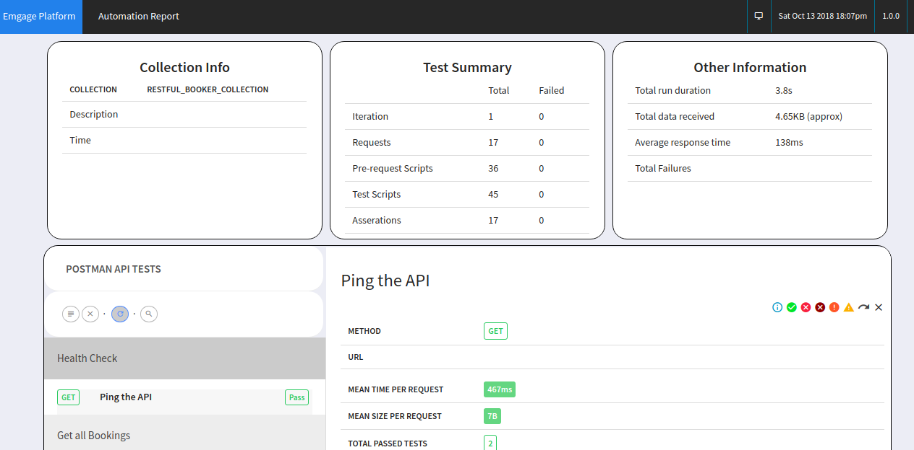
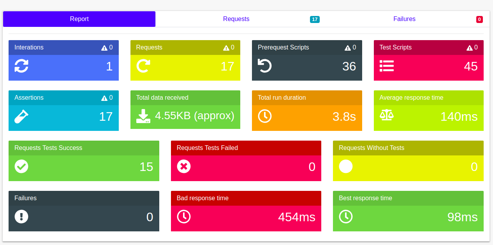
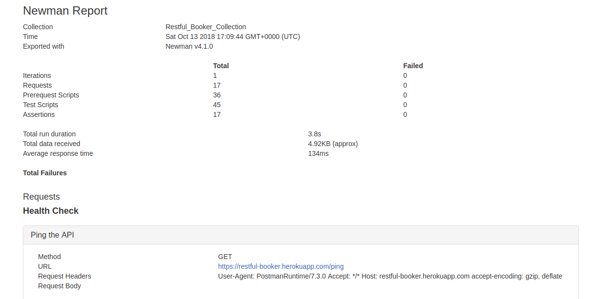

# Run Postman Collections Using Docker

```yml
version: "2"
services:
  postman_checks:
      container_name: restful_booker_checks
      build: .
      image: postman_checks
      command:
        run Restful_Booker_Collection.json 
        -e environments/Restful_Booker_Environment.json 
        -r html,cli 
        --reporter-html-export reports/Restful_Booker_Test_Run.html 
        --reporter-html-template reports/templates/customTemplate_2.hbs
      volumes:
        - ./src:/etc/newman
```

```dockerfile

FROM node:16.16.0-alpine

RUN npm install -g newman newman-reporter-html

WORKDIR /etc/newman

ENTRYPOINT ["newman"]
```


An example of each of the awesome templates from the repo's listed above:

#### Custom Template 1


#### Custom Template 2


#### Custom Template 3



### Running The Collection

```bash
docker-compose up
```

```bash
docker-compose rm -f
```

